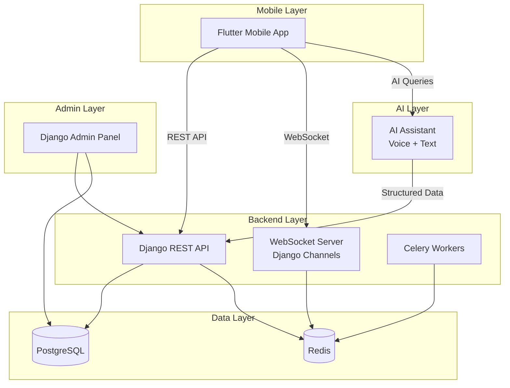
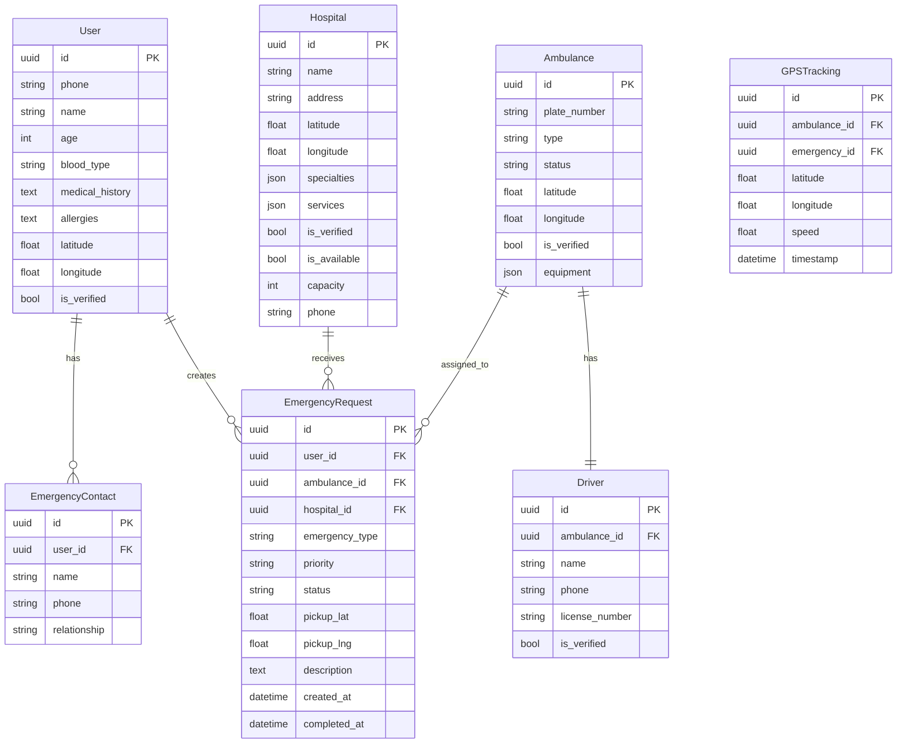

# 🚑 AI Emergency Referral & Transport System — Implementation Plan

## 📋 Project Overview

A real-time, AI-assisted emergency response platform connecting patients, ambulances, and healthcare providers. The system ensures faster response times, better coordination, and reliable access even in low-connectivity areas.

---

## 🏗️ Architecture Overview



---

## 🔧 Technology Stack

| Component | Technology |
|-----------|-----------|
| Mobile App | Flutter (Dart) |
| Backend API | Django + Django REST Framework |
| Real-Time | Django Channels + WebSockets |
| Database | PostgreSQL |
| Cache/Broker | Redis |
| Task Queue | Celery |
| AI Assistant | Google Gemini API / OpenAI API |
| Maps | Google Maps API / Mapbox |
| Auth | Phone OTP (Django + Twilio/Africa's Talking) |
| Admin Panel | Django Admin (customized) |
| Deployment | Docker + Docker Compose |

---

## 📁 Project Structure

```
AI Emergency Referral & Transport System/
├── backend/                    # Django Backend
│   ├── config/                 # Django project settings
│   │   ├── settings.py
│   │   ├── urls.py
│   │   ├── asgi.py
│   │   └── wsgi.py
│   ├── apps/
│   │   ├── users/              # User management & auth
│   │   ├── hospitals/          # Hospital management
│   │   ├── ambulances/         # Ambulance management
│   │   ├── emergencies/        # Emergency dispatch
│   │   ├── tracking/           # GPS & real-time tracking
│   │   ├── ai_assistant/       # AI communication
│   │   └── notifications/      # Push notifications
│   ├── manage.py
│   ├── requirements.txt
│   └── Dockerfile
├── mobile/                     # Flutter Mobile App
│   ├── lib/
│   │   ├── main.dart
│   │   ├── config/
│   │   ├── models/
│   │   ├── providers/
│   │   ├── screens/
│   │   ├── services/
│   │   ├── widgets/
│   │   └── utils/
│   └── pubspec.yaml
├── docker-compose.yml
└── README.md
```

---

## 🚀 Phase 1: Backend Foundation (Django)

### 1.1 Project Setup
- [x] Initialize Django project with proper settings
- [x] Configure PostgreSQL database
- [x] Setup Redis for caching and WebSocket
- [x] Configure Django REST Framework
- [x] Setup Django Channels for WebSocket
- [x] Configure CORS and security middleware

### 1.2 User Authentication (`apps/users/`)
- [ ] Phone number-based registration
- [ ] OTP verification system
- [ ] JWT token authentication
- [ ] User profile management (blood type, allergies, medical history)
- [ ] Emergency contact management

### 1.3 Hospital Management (`apps/hospitals/`)
- [ ] Hospital registration & verification workflow
- [ ] Hospital profile (services, specialties, location, capacity)
- [ ] Availability status management
- [ ] Search & filtering (location, specialty, availability)

### 1.4 Ambulance Management (`apps/ambulances/`)
- [ ] Ambulance registration & verification
- [ ] Driver verification system
- [ ] Ambulance status management (available, en-route, busy)
- [ ] Equipment/type cataloging

### 1.5 Emergency Dispatch (`apps/emergencies/`)
- [ ] Emergency request creation
- [ ] Nearest ambulance assignment algorithm
- [ ] Hospital suggestion engine
- [ ] Emergency lifecycle tracking (requested → dispatched → en-route → arrived → completed)
- [ ] Priority classification system

### 1.6 Real-Time Tracking (`apps/tracking/`)
- [ ] WebSocket consumers for live location
- [ ] GPS coordinate storage & retrieval
- [ ] ETA calculation
- [ ] Route tracking

### 1.7 AI Assistant (`apps/ai_assistant/`)
- [ ] Text input processing
- [ ] Voice-to-text integration
- [ ] Emergency type detection
- [ ] Location extraction
- [ ] Structured emergency request generation
- [ ] Amharic & English language support

---

## 🚀 Phase 2: Admin Panel

### 2.1 Django Admin Customization
- [ ] Hospital approval/rejection dashboard
- [ ] Ambulance approval/rejection dashboard
- [ ] Emergency monitoring view
- [ ] User management interface
- [ ] System analytics dashboard
- [ ] Activity logs viewer

---

## 🚀 Phase 3: Flutter Mobile App

### 3.1 App Foundation
- [ ] Project setup with proper architecture (Provider/Riverpod)
- [ ] Theme system (dark mode)
- [ ] Navigation & routing
- [ ] API service layer
- [ ] WebSocket service layer

### 3.2 Authentication Screens
- [ ] Phone number login screen
- [ ] OTP verification screen
- [ ] Profile setup screen
- [ ] Emergency quick access mode

### 3.3 Emergency System
- [ ] One-click emergency button (home screen)
- [ ] Emergency type selection
- [ ] GPS location sharing
- [ ] Real-time status updates
- [ ] Emergency history

### 3.4 Live Tracking
- [ ] Map integration (Google Maps)
- [ ] Real-time ambulance tracking
- [ ] Route visualization
- [ ] ETA display

### 3.5 Search & Discovery
- [ ] Hospital search with filters
- [ ] Clinic search
- [ ] Ambulance search
- [ ] Map-based exploration

### 3.6 Offline System
- [ ] Local database (Hive/SQLite)
- [ ] Offline hospital directory
- [ ] Offline ambulance contacts
- [ ] Cached location data
- [ ] Auto-sync mechanism

### 3.7 User Profile
- [ ] Profile management
- [ ] Medical history
- [ ] Emergency contacts
- [ ] Blood type & allergies

### 3.8 AI Assistant Interface
- [ ] Chat interface
- [ ] Voice input button
- [ ] Text-to-speech responses
- [ ] Language toggle (Amharic/English)

---

## 🚀 Phase 4: Integration & Testing

### 4.1 System Integration
- [ ] Flutter ↔ Django REST API
- [ ] WebSocket real-time sync
- [ ] Offline-to-online sync
- [ ] AI → Backend pipeline

### 4.2 Testing
- [ ] Backend unit tests
- [ ] API integration tests
- [ ] Flutter widget tests
- [ ] End-to-end testing

---

## 📊 Database Schema (Key Models)



---

## ⚠️ Key Decisions Needed

> [!IMPORTANT]
> Before proceeding, please confirm the following:

1. **AI Provider**: Should I use Google Gemini API or OpenAI API for the AI assistant?
2. **Maps Provider**: Google Maps or Mapbox for mapping?
3. **SMS/OTP Provider**: Twilio, Africa's Talking, or another provider for phone OTP?
4. **Deployment Target**: Local development only, or should I include Docker/cloud deployment configs?
5. **Start Priority**: Should I begin with the **Django Backend** first, then the **Flutter app**? Or build them in parallel?
6. **Database**: PostgreSQL (production-ready) or SQLite (simpler for development)?

---

## 🎯 Immediate Next Steps

Once you confirm the decisions above, I'll begin with:

1. **Set up the Django backend project** with all apps
2. **Create the database models** for all entities
3. **Build the REST API endpoints** 
4. **Configure WebSocket** for real-time tracking
5. **Set up the Flutter project** with proper architecture
6. **Build the core UI screens**
